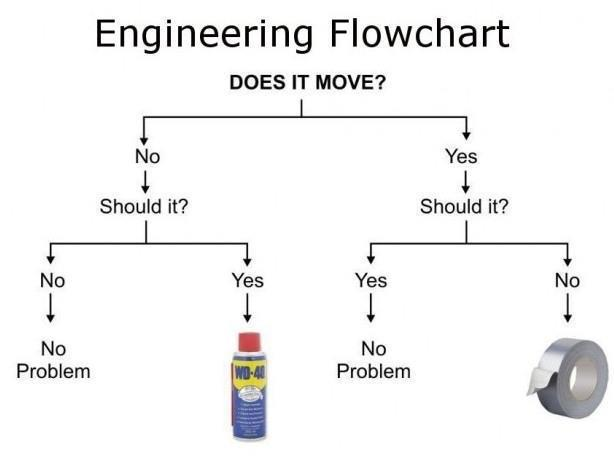

# Billedmanipulation
I dette forløb vil vi arbejde med billedmanipulation.

# Indholdsfortegnelse

* [Slides](#slides-til-undervisningen)
* [Projektopgave](#projektopgave)
* [Billedbehandling med p5js](#billedbehandling-med-p5js)
* [Programoversigt](#programoversigt)
* [GIMP billedbehandling](#billedbehandling-i-gimp)

# Slides til undervisningen
[Billedmanipulation1 slides](https://drive.google.com/open?id=1wM5pYU8eP08tujXp0M8mXqXdc9tLOkgLNUVAJqtBMC8)

[Billedmanipulation2 slides](https://drive.google.com/open?id=1fPLhh2m5WEBlbgeCrJ2RMZLczG5zBS4olBct83mYDsc)

[Billedmanipulation3 slides](https://drive.google.com/open?id=1BeQpWCXfe0y37lRzftKbN7Sgs3_KrUnRzLoD5M9uwK4)

# Projektopgave
Med udgangspunkt i følgende case, skal du udvikle en del af en løsning.
 
Alle ved at billeder af hvordan verden, og især os selv, ser ud er dybt uinteressante. For at ændre på dette skal I lave et billedbehandlingsprogram.


I skal derfor udvikle et program, der
* Kan redigere et billede ved manipulation på pixelniveau.
* Kan tilføje effekter.
 
I den forbindelse skal I have fokus på brugeren hvor I skal
Bestemme hvad der er kerne- og hvad der er sekundære faciliteter.

I logbogen skal I dokumentere arbejdsprocessen og produktet undervejs.

# Billedbehandling med p5js
Samling af js programmer til undervisningsbrug i billedmanipulation, eller billedbehandling. Programmerne kan køres med live-server gennem `index.html` filen ved at henvise til den rigtige js fil.

Filerne er lavet med js biblioteket P5.js.

# JS fil gennem index.html
Vi bruger biblioteket p5.js, og kører vores js fil gennem en html side. Nedenunder er index filen som også ligger på github siden.
```
<!DOCTYPE html>
<html lang="">
  <head>
    <meta charset="utf-8">
    <meta name="viewport" content="width=device-width, initial-scale=1.0">
    <title>p5.js example</title>
    <style> body {padding: 0; margin: 0;} </style>
    <script src="https://cdn.jsdelivr.net/npm/p5@0.10.2/lib/p5.js"></script>
    <script src="JSfiler/generalFilterSharpening.js"></script>
  </head>
</html>
```
De to vigtige linjer er,
```<script src="https://cdn.jsdelivr.net/npm/p5@0.10.2/lib/p5.js"></script> ```, hvor p5.js biblioteket indlæses og
```     <script src="JSfiler/generalFilterSharpening.js"></script> ```, hvor js filen ```generalFilterSharpening.js```indlæses.


## Øvelse 1
* Download hele repository og åben den som en mappe i Brackets.
* Ret ```<script src="JSfiler/generalFilterSharpening.js"></script> ``` så det er ```HelloWorld.js``` filen som bruges.
* Prøv med nogen af den andre programmer.

# Programmet online på Github

I kan bruge Github til at køre jeres programmer online. Index.html filen skal indeholde reference til js filen og så skal den gøres tilgængelig.

på Github skal I gå in i:
index.html -> Settings -> options -> Github pages.

Denne siden kan ses på
[https://mpsteenstrup.github.io/Billedmanipulation/](https://mpsteenstrup.github.io/Billedmanipulation/)

Indsæt selv brugernavn og repository
 `https://username.github.io/repository/`

# Programoversigt
## simple programmer til introduktion
* `HelloWorld.js`
* `simpleImageLoad.js`
* `sortHvis.js`, brug af indbygget filter

## Loade og genne billeder i programmet
* `loadImage.js`
* `saveImage.js`

## forståelse af pixels, i,j
* `loopIJColors.js`, 4x4 pixels
* `getPixelValue.js`, pixelværd
* `getPixelValueFast.js`, implementering af hurtig læsning af pixelværdier, ved brug af liste.

## manuelle filtre
* `generalFilter.js`
* `generalFilterSharpening.js`
* `posterFilter.js`
* `blurFilter.js`
* `gradientFilter.js`
* `KantdetektionFilterManuel.js`
* `pixelate.js`

## flere filtre hvor man opdaterer pixelværdierne under vejs
* `filterSaveUpdatePixelValues.js`


# opgaver til nogle af programmerne

## colorFilterManuel
fill((c[0]+c[1]+c[2])/3);

* undersøg hvad c indeholder
* undersøg hvordan billedet ser ud med c[i], i=0,1,2
* Hvordan laver man et farvefilter?

## Gradient farvefilter
fill((c[0]+c[1]+c[2])/(3)-j);

* Kør filtret og se hvad det gør
* lav en forbedring så det ser ordentligt ud

## Kantdetektion

* Undersøg hvad koden gør

## Billedbehandling i GIMP
I GIMP vælg: Filters -> Generic -> convolution matrix.

Generelle regler for foldning.

Hvis samme fortegn giver det en udglatning

Hvis modsat fotegn giver det en tydeligere kant.

## Hvorfor blur filtre ofte er forkerte
her er en lille video som forklare det, (https://www.youtube.com/watch?v=LKnqECcg6Gw)[https://www.youtube.com/watch?v=LKnqECcg6Gw].


## Opsætning af Teletype

Hvis man vil samarbejde om samme dokument, kan man bruge Teletype. Efter en har delt sit dokument kan det gemmes og køres lokalt.


Gå ind på:

Præferencer -> install -> Teletype og enable den.

Klik nederst på "radiotårnet" og følge linket til en token.

Del filen med på "radiotårnet" og send link til de andre.


# Flowchart eller Rutediagram

Et flowchart eller rutediagram er en standardiseret grafisk repræsentation af rækkefølgen af ​​operationer. Det kan bruges til at lave modeller af processer og er centralt i process-optimering og strukturering.

Et flowchart har følgende elementer, start, hændelse, forgrening og slut og rækkefølgen vises med pile.
,

Selvom symbolerne er standardiserede kan der godt forekomme afvigelser, som her med ingeniørens ynglingsdiagram.


Jo dummere noget er jo mere præcise skal instruktionerne være. Her må vi sige at computere er meget dumme, men det kan mennesker nu også være, [peanutbuttersandwich](https://youtu.be/j-6N3bLgYyQ).

Her er et simpelt eksempel på logikken i en pumpe til bildæk.


Flowcharts kan laves i hånden men dette program virker også, [https://app.diagrams.net](https://app.diagrams.net).

### Øvelse
* Lav om i ovenstående rutediagram så pumpen også kan tage højde for at dæktrykket kan være for højt.

Rutediagrammer behøver ikke at være forbeholdt mekaniske processer eller programmeringsstrukturer. Det kan også være
* Folks bevægelse på en hjemmeside.
* Strukturering af tanker og beslutningsprocesser.
* Datastrømme.
* Arbejdsgangen ved løsning af matematikopgaver.
* Find selv på et par stykker.

## Billedmanipulation

### Øvelse, brugerniveau
I forhold til billedmanipulation skal I udarbejde et rutediagram over brugerens interaktion med programmet. Lav en model for hvad brugeren ser, hvilke handlinger brugeren foretager og hvad slutresultatet er.

### Øvelse, pixelniveau.
Lav et flowchart over hvad der sker på pixelniveau.
